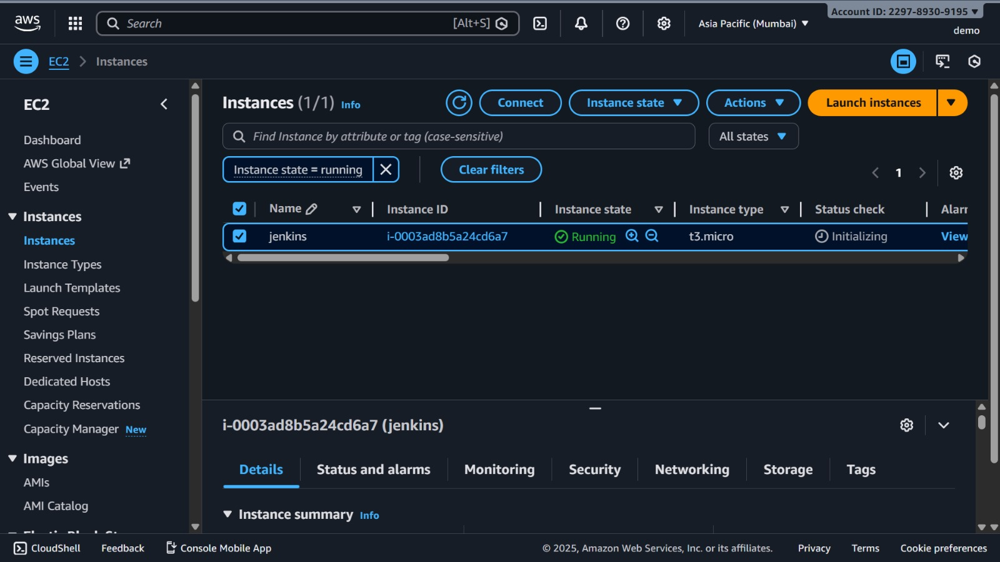

# EC2 Instance Launch

## Region
ap-south-1 (Mumbai)

## Instance Type
t2.micro (Free Tier)

## Configuration
- Amazon Linux / Ubuntu AMI
- Key pair for SSH access
- Security group:
  - Port 22 (SSH)
  - Port 8080 (Jenkins)

## Purpose
This EC2 instance was used to deploy Jenkins for hands-on learning.

### EC2 Instance Running

